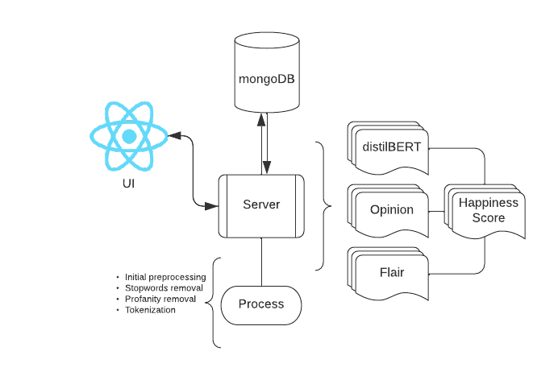

#### For CS521 at the University of Illinois, Chicago

# Opinions
## _For Everyone!_

Opinions shows you the happiness/satisfaction index on scale of 1 - 10 for top 500 US universities based on their professors' rating. 
In addition to the universities, you can also find the individual professor rating for any of those universities.

## Features
- Select a university from the dropdown
- See its happiness/satisfaction index
- Select a professor from that university 
- See their analysis charts
- Make your decision

## Description
Please refer the flowchart below for a step-by-step walk through.



## Requirements

Opinions uses many open source technologies to show you what you asked for:

- [ReactJS 18.0.0] - HTML enhanced for web apps!
- [Python 3.9.12] - makes the magic happen
- [mongoDB Atlas] - NoSQL db to make our lives easier (.env containing host info is required)

Important libraries:

- [Flask] - not-so-tiny webserver
- [BeautifulSoup] - scrape all the web
- [NLTK] - preprocessing, sentiment analyser
- [Flair] - distilBERT/text sentiment classifier
- [BetterProfanity] - preprocessing, bad word remover
- [MongoEngine] - for everything that's mongodb
- [d3.js] - graphing library

Opinions is open source for future work.


## Installation

```sh
git clone https://github.com/nehsus/opinions
cd opinions
./run.sh or bash run.sh
```
run.sh:
```sh
#!/bin/bash
echo "Initializing backend.."
cd backend && 
    python3 -m venv opinion_env &&
    source opinion_env/bin/activate &&
    pip3 install -r requirements.txt &&
    echo "done!" &&
    
echo "init ui.." &&
cd ../ &&
    npm install --save &&
    echo "done!" &&
    npm run start
```

## Results
## Future work

